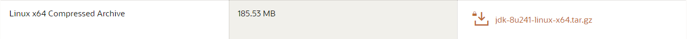

# Ubuntu 子系统安装使用

## 目录

- [背景](#背景)
- [安装](#安装)
- [使用](#使用)  
  - [zsh](#zsh)
  - [配置 java 环境](#配置java环境)

## 背景

操作系统：windows10  
最近使用时间：2020.3.27

## 安装

第一步：  

设置 -> 更新和安全 -> 开发者选项 -> 勾选 **开发人员模式**。  
  

第二步：  

控制面板 -> 程序 -> 启动或关闭 Windows 功能 -> 勾选 **适用于 Linux 的 Windows 子系统**。 

  
  

第三步：  

打开 Microsoft Store，搜索 Ubuntu 下载即可。

## 使用

打开 ubuntu，第一次会加载一会。  
加载完成后会提示用户设置一个用户名和密码。  
然后就可以正常使用。  

### zsh

安装 zsh：  
```
sudo apt-get install zsh
```  
安装后通过 `zsh --version` 可以查看 zsh 的版本。  

安装 oh-my-zsh 可以通过 curl 或者 wget 方式：  
curl：  
```
sh -c "$(curl -fsSL https://raw.githubusercontent.com/robbyrussell/oh-my-zsh/master/tools/install.sh)"
```  
wget:  
```
sh -c "$(wget https://raw.githubusercontent.com/robbyrussell/oh-my-zsh/master/tools/install.sh -O -)"
```

把默认的 Shell 改成 zsh：  
```
chsh -s /bin/zsh
```

### 配置java环境

第一步：  
下载 jdk（笔者选择的版本为 jdk8，想选择其他版本可自行更改），下载地址：  
http://www.oracle.com/technetwork/java/javase/downloads/jdk8-downloads-2133151.html  

选择 64 位，linux 压缩包。  
  

第二步：  
打开 utuntu 命令行，创建 /usr/lib/jvm 文件夹，并将下载的压缩包移到此处，然后解压。  
```
sudo mkdir /usr/lib/jvm
sudo mv /mnt/c/User/你的电脑用户名/Downloads/jdk-8u241-linux-x64.tar.gz /usr/lib/jvm
sudo tar -zxvf jdk-8u241-linux-x64.tar.gz
```

第三步：  
配置环境变量。使用命令：`sudo vim ~/.zshrc`（如果没有安装 zsh，则使用 `sudo vim ~/.bashrc`）。  

在打开的文件底部添加四行命令：  
```
export JAVA_HOME=/usr/lib/jvm/jdk1.8.0_241（如 jdk 版本与笔者不同就自行更改）
export JRE_HOME=${JAVA_HOME}/jre
export CLASSPATH=.:${JAVA_HOME}/lib:${JRE_HOME}/lib
export PATH=${JAVA_HOME}/bin:$PATH
```


最后执行命令：`source ~/.bashrc`（如果没有安装 zsh，则使用 `source ~/.bashrc`）使配置生效。

第四步：  
检查环境变量是否配置成功：`java -version`。