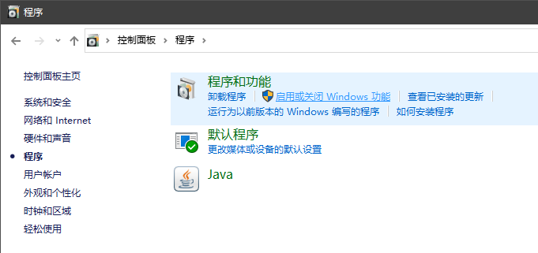
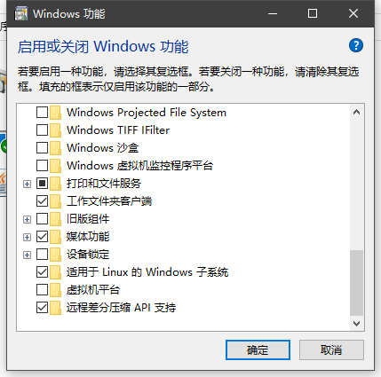

# Ubuntu子系统安装使用

## 背景

操作系统：windows10  
最近使用时间：2020.3.27

## 安装

第一步：  

设置 -> 更新和安全 -> 开发者选项 -> 勾选 **开发人员模式**。  
  

第二步：  

控制面板 -> 程序 -> 启动或关闭 Windows 功能 -> 勾选 **适用于 Linux 的 Windows 子系统**。 

  
  

第三步：  

打开 Microsoft Store，搜索 Ubuntu 下载即可。

## 使用

打开 ubuntu，第一次会加载一会。  
加载完成后会提示用户设置一个用户名和密码。  
然后就可以正常使用。  

### zsh

安装 zsh：  
```
sudo apt-get install zsh
```  
安装后通过 `zsh --version` 可以查看 zsh 的版本。  

安装 oh-my-zsh 可以通过 curl 或者 wget 方式：  
curl：  
```
sh -c "$(curl -fsSL https://raw.githubusercontent.com/robbyrussell/oh-my-zsh/master/tools/install.sh)"
```  
wget:  
```
sh -c "$(wget https://raw.githubusercontent.com/robbyrussell/oh-my-zsh/master/tools/install.sh -O -)"
```

把默认的 Shell 改成 zsh：  
```
chsh -s /bin/zsh
```

