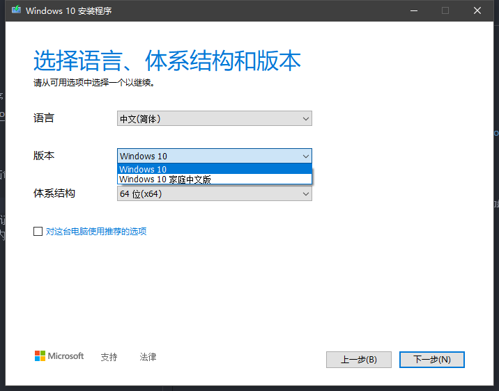
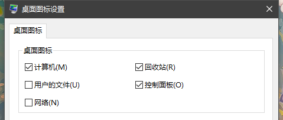
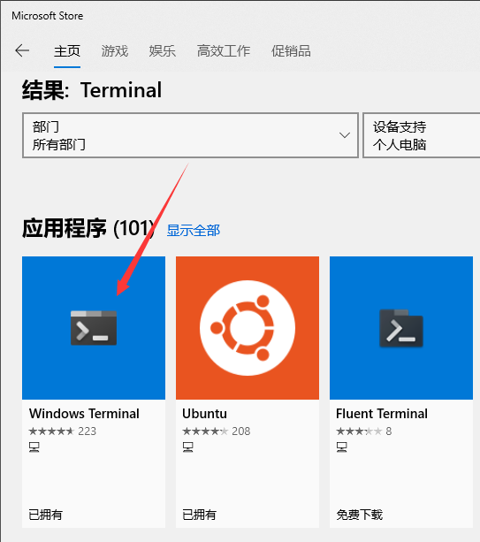
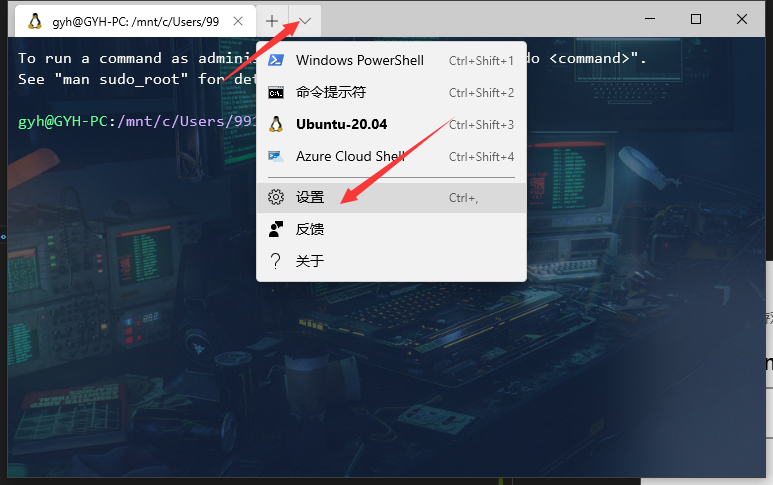

# Windows 使用

## 目录

- [装系统](#装系统)  

- [安装后事项](#安装后事项)  

- [基础软件](#基础软件)  

- [计算机专业](#计算机专业)

## 装系统

**（1）第一步 下载 Windows10 安装程序**  

地址：https://www.microsoft.com/zh-cn/software-download/windows10  

**（2）第二步 制作启动盘**  

运行安装程序，选择「为另一台电脑创建安装介质」选项。  

选择版本（专业版或家庭版）：  

接着选择安装介质。一般使用 U 盘，其中要保证 U 盘大小超过 8GB，制作安装介质后 U 盘里的所有内容都将被删除，因此 U 盘内的重要文件记得备份。  
下载过程较为漫长，等待即可。  

**（3）第三步 安装**  

U 盘插在准备装系统的电脑上，重启。在开机瞬间摁 <kbd>F12</kbd> 会有「滴」的一声（不同主板启动按键不同，摁下没有反应可尝试其他按键或直接网上查询）。  

方向键选择启动介质，回车进入安装程序，根据提示操作即可。

## 安装后事项

**（1）第一步，更新系统**  

设置 -> 更新和安全 -> Windows 更新 -> 检查更新  

注：更新过程一般需要重启多次。

**（2）第二步，设置桌面图标，修改计算机名**  

设置 -> 个性化 -> 主题 -> 桌面图标设置，选择需要的桌面图标。

在桌面右击**此电脑**，选择**属性**，**修改计算机名**（建议英文且不含空格，方便命令行显示）。  

**（3）第三步，卸载无用软件，清理「开始」处磁贴**  

**（4）第四步，禁用 WinDef**  

<a href="./file/DF一键关闭.zip" download="DF"> DF 一键关闭 </a>

**（5）第五步，在 C 盘创建「MyPrograms」文件夹，以后将软件安装在此**  

**（6）第六步，安装火绒**  

## 基础软件

### Office  

- Office 专业增强版 2019  

### 浏览器
- Microsoft Edge  

- Google Chrome  

- Firefox  

### 网盘
- 百度网盘  

### 视频播放
- <a href = "http://potplayer.daum.net/"> PotPlayer </a>

### 解压软件
- <a href = "https://www.7-zip.org"> 7Zip </a>  
  体积小，好用。

### 笔记
- 有道云笔记  

- Typora

### 游戏
- Steam  

- WeGame  

- Epic  

- Uplay

### QQ 系
- QQ

- 微信

- QQ 音乐

### 科学上网

- shadowsocks  

- v2ray  

## CS
- VSCode  

- Sublime Text3

- IDEA  

## WindowsTerminal

**（1）在 Microsoft 搜索并下载。**  

**（2）自定义属性**

  

<a href="https://aka.ms/terminal-documentation">Windows Terminal官方文档</a>

## 常见问题

### 语言栏

问题：不小心将语言栏添加在任务栏。

解决：设置 -> 设备 -> 输入 -> 高级键盘设置 -> 取消勾选「使用桌面语言栏」即可恢复。   

